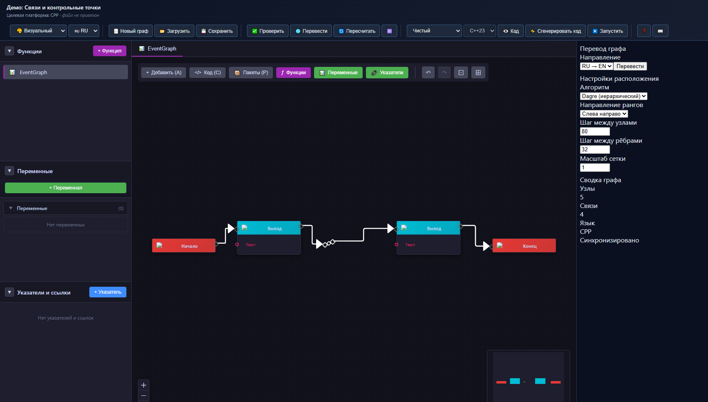
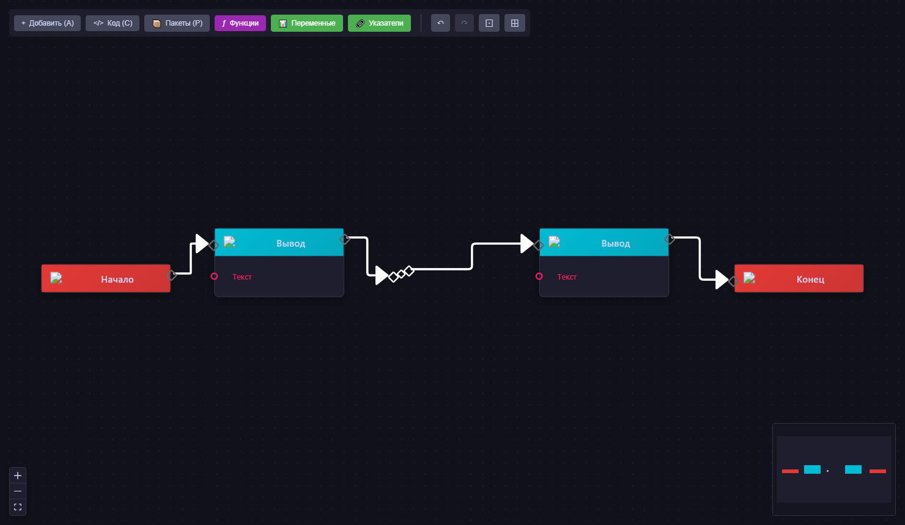

# MultiCode — Визуальное программирование для русскоязычных разработчиков

[](LICENSE)
[](https://github.com/redvampir/multicode/releases)
[](https://github.com/redvampir/multicode)

> **Проект создаётся для русскоязычной аудитории.** Главная цель — дать возможность создавать и работать с визуальными графами на русском языке: русские названия узлов, русские комментарии, полная локализация интерфейса.

---

## ✨ Ключевые особенности

### 🇷🇺 Русский язык — первый класс поддержки
- **Русские названия узлов**: "Начало", "Ветвление", "Цикл For", "Вывод" вместо Start/Branch/ForLoop/Print
- **Русские комментарии в коде**: генерируемый C++ код сохраняет русские названия в комментариях
- **Полная локализация UI**: все элементы интерфейса переведены на русский
- **Переключение RU/EN**: мгновенная смена языка без перезагрузки

### 🎨 Blueprint-редактор (React Flow)
Визуальный редактор узлов в стиле flow-based программирования:
- Цветовая схема типов данных (адаптирована)
- Exec-порты (серые квадраты) для потока выполнения  
- Data-порты (цветные круги) для передачи данных
- Drag-and-drop соединение с валидацией типов
- Редактируемые **связи**: двойной клик по связи добавляет контрольную точку (`Reroute`)
- Быстрое удаление связи: `Alt + двойной клик` по связи
- **Undo/Redo** — отмена и повтор действий (`Ctrl+Z` / `Ctrl+Y`)
- **Copy/Paste** — копирование узлов с сохранением связей

#### Скриншоты интерфейса

Общий вид Blueprint-редактора со связями и контрольной точкой:



Фокус на редактировании связи через контрольную точку:



### 🔄 Генерация C++ кода
- Преобразование визуального графа в исполняемый C++ код
- Русские комментарии в сгенерированном коде
- Предпросмотр кода в реальном времени


### 🗺️ Статус поддержки языков кодогенерации

| Язык | Статус | Примечание |
|------|--------|------------|
| C++ | ✅ Готово | Полноценная генерация кода и предпросмотр |
| Rust | ⚠️ В разработке | Сейчас выводится явное предупреждение о неподдержке |
| ASM | ⚠️ В разработке | Сейчас выводится явное предупреждение о неподдержке |

### 💻 Кроссплатформенность
- **Windows** — полная поддержка
- **Linux** — Ubuntu 22.04+, Debian 12+

### 🚀 Поддержка редакторов
- **VS Code** — полная поддержка (v1.85.0+)
- **Cursor** — полная совместимость (см. [инструкцию по установке](vscode-extension/CURSOR_INSTALLATION.md))

**Примечание:** Это независимая реализация визуального программирования, не связанная с Epic Games Unreal Engine.

---

## ✅ Текущее состояние проекта

### Версия и этапы
- **Релизная версия расширения:** `0.4.1` (источник истины — `vscode-extension/package.json`)
- **Внутренние вехи roadmap:** v0.1–v0.5 завершены; v0.6 (пользовательские функции) — в работе
- **Плановый этап продукта:** подготовка к `v1.0` (стабилизация API, документация, публикация)

### C++ ядро
- Строгие ID для узлов/портов/соединений (`Types.hpp`)
- `Node`, `Port`, `Graph`, `NodeFactory` с полной валидацией
- Топологическая сортировка, обнаружение циклов, статистика графа
- JSON сериализация с версионированием схемы

### VS Code расширение
- **Blueprint-редактор** на React Flow — основной режим
- **Classic-редактор** на Cytoscape — legacy режим
- **Генерация C++ кода** из визуального графа
- Локализация RU/EN с мгновенным переключением
- Undo/Redo, Copy/Paste, автолейаут, контекстное меню
- Система пакетов узлов
- Пользовательские функции: UI и модель (кодогенерация функций — в работе)
- IPC протокол с Zod-валидацией

---

## 📸 Скриншоты текущей версии (без бинарных файлов)

### Blueprint-редактор (основной)

[Заглушка скриншота Blueprint-редактора](Документы/Скриншоты/blueprint-editor.md)

### Classic-редактор (legacy)

[Заглушка скриншота Classic-редактора](Документы/Скриншоты/classic-editor.md)

---

## 🚀 Быстрый старт

### Сборка C++ ядра

#### Windows (PowerShell)
```powershell
.\scripts\build-cmake-utf8.ps1
```

#### Linux (Ubuntu 22.04+ / Debian 12+)
```bash
# Установка зависимостей
sudo apt update && sudo apt install -y cmake g++ git

# Клонирование и сборка
git clone https://github.com/redvampir/multicode.git
cd multicode
cmake -S . -B build -DCMAKE_BUILD_TYPE=Release
cmake --build build -j$(nproc)
ctest --test-dir build --output-on-failure
```

### Запуск VS Code расширения

```bash
cd vscode-extension
npm install
npm run compile
# F5 в VS Code для запуска Extension Development Host
```

### Сборка и установка готового расширения

```bash
cd vscode-extension
npm install
npm run package        # production-бандлы: dist/extension.js и dist/webview.js
npm run vsix:no-deps   # installable .vsix
# Установить: Extensions > ... > Install from VSIX
```

`npm run package` сам по себе не создаёт `.vsix` и не устанавливается через VS Code. Для установки нужен `npm run vsix` или `npm run vsix:no-deps`.

---

## Архитектура

```
MultiCode/
├── include/visprog/core/     # C++ публичные заголовки
│   ├── Types.hpp             # NodeId, PortId, Result<T>
│   ├── Node.hpp              # Узел графа
│   ├── Port.hpp              # Порты узлов
│   ├── Graph.hpp             # Контейнер графа
│   ├── NodeFactory.hpp       # Фабрика узлов
│   └── GraphSerializer.hpp   # JSON сериализация
├── src/core/                 # C++ реализации
├── tests/                    # Catch2 тесты
├── vscode-extension/
│   ├── src/
│   │   ├── extension.ts      # Точка входа
│   │   ├── panel/            # GraphPanel, IPC
│   │   ├── webview/          # React компоненты
│   │   │   ├── BlueprintEditor.tsx  # React Flow редактор
│   │   │   ├── ErrorBoundary.tsx    # Обработка ошибок React
│   │   │   ├── ContextMenu.tsx      # Контекстное меню
│   │   │   ├── PackageManagerPanel.tsx  # Менеджер пакетов
│   │   │   ├── hooks/        # React хуки
│   │   │   │   ├── useUndoRedo.ts    # Undo/Redo с debounce
│   │   │   │   ├── useClipboard.ts   # Copy/Cut/Paste
│   │   │   │   ├── useAutoLayout.ts  # Dagre автолейаут
│   │   │   │   └── usePackageRegistry.ts  # Загрузка пакетов
│   │   │   └── nodes/        # Кастомные узлы React Flow
│   │   ├── codegen/          # Генераторы кода
│   │   └── shared/           # Типы, сообщения, переводы
│   └── dist/                 # Скомпилированные файлы
├── packages/                 # Пакеты узлов
│   └── std/                  # @multicode/std — стандартный пакет
└── Документы/                # Документация на русском
```

---

## Типы узлов

| Категория | Узлы (RU) | Узлы (EN) |
|-----------|-----------|-----------|
| Управление | Начало, Конец, Ветвление, Переключатель | Start, End, Branch, Switch |
| Циклы | Цикл For, Цикл While, Последовательность | ForLoop, WhileLoop, Sequence |
| Переменные | Переменная, Получить, Установить | Variable, Get, Set |
| Математика | Сложение, Вычитание, Умножение, Деление | Add, Subtract, Multiply, Divide |
| Логика | И, Или, Не, Сравнение | And, Or, Not, Compare |
| Ввод/Вывод | Вывод, Ввод | Print, Input |

---

## Основные реализованные блоки

### v0.4 (релиз 0.4.x, текущий: 0.4.1)
- **Undo/Redo**, **Copy/Paste**, автолейаут и горячие клавиши
- Контекстное меню и стабилизация UX редактора

### v0.5 (внутренняя веха)
- Загрузка пакетов узлов через JSON Schema
- `PackageLoader`, `PackageRegistry`, `PackageManagerPanel`

### v0.6 (внутренняя веха)
- Пользовательские функции: UI/модель (`FunctionEntry`, `FunctionReturn`, `CallUserFunction`)
- Кодогенерация пользовательских функций (C++) — 🚧 в работе (см. `ROADMAP.md`)

---

## 🗓️ Ближайшие задачи

1. Стабилизация публичного API перед `v1.0`
2. Повышение покрытия тестами и метрик качества
3. Актуализация пользовательской документации
4. Подготовка и публикация в VS Code Marketplace

---


## 🧪 CI-карта (GitHub Actions)

| Workflow | Назначение | Что запускает | Когда запускать |
|----------|------------|---------------|-----------------|
| `.github/workflows/ci.yml` | Быстрый smoke-check C++ | Только `cmake configure + build` на Linux (GCC 12, Ninja, vcpkg) | Каждый PR/Push с изменениями C++ или CI-файлов |
| `.github/workflows/cpp-build.yml` | Полная проверка C++ | Windows + Linux сборка, `ctest`, `clang-tidy`, coverage | Каждый PR/Push с изменениями C++ или CI-файлов |

**Важно:** `ci.yml` не запускает `ctest`, поэтому на один PR нет двух конкурирующих C++ тест-прогонов. Полный тестовый прогон живёт только в `cpp-build.yml`.

## Участие в проекте

- Pull Request должен компилироваться и проходить `ctest`
- Новый функционал требует тестов в `tests/core`
- Перед коммитом: `clang-format` для C++, `npm run lint` для TypeScript
- **Документация на русском** — приветствуется

### Форматирование C++

```bash
git ls-files '*.hpp' '*.cpp' | grep -v third_party | xargs clang-format -i
```

---

## Документация

| Документ | Описание |
|----------|----------|
| [Документы/README.md](Документы/README.md) | Единый индекс активных и архивных документов |
| [AGENTS.md](AGENTS.md) | Нормативные правила для ИИ-агента в проекте |
| [AI_AGENTS_GUIDE.md](AI_AGENTS_GUIDE.md) | Руководство для ИИ-агентов |
| [CODING_GUIDELINES.md](CODING_GUIDELINES.md) | Правила кодирования |
| [ROADMAP.md](ROADMAP.md) | План версий |
| [Документы/ProjectStatus.md](Документы/ProjectStatus.md) | Фактический статус компонентов |

---

## Лицензия

MIT License. См. [LICENSE](LICENSE).

---

> **MultiCode** — визуальное программирование на русском языке. Создавайте графы, генерируйте код, работайте на родном языке.
